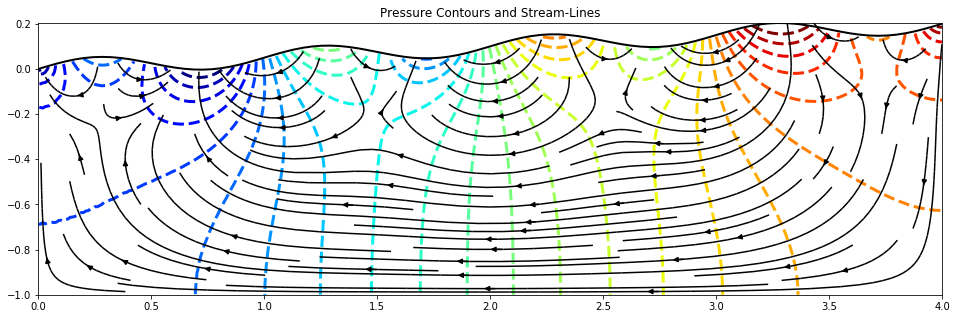

Author
------
Adam Beall (@adambeall)

About
-----
The darcy flow solver, ``uw.systems.SteadyStateDarcyFlow``, can solve for ground-water flow induced by an imposed pressure-gradient and/or a gravity term. In this example we show how groundwater flow beneath hetereogeneous topography can be modelled in each of these two ways.

If the gravity term is included, then a deformed mesh which captures topography will drive groundwater flow.
Without the gravity term, a pressure boundary condition can be set at the top of an undeformed mesh, which mimics the change in groundwater pressure induced by topography.

Classic models of groundwater flow in a hill-side with undulating topography were solved analytically in Toth. J, *A Theoretical Analysis of Groundwater Flow in Small Drainage Basins*, Journal of Geophysical Research, 1963. Their simple model is reproduced here, particularly the geometry in their Fig. 2e.

Files
-----

File | Purpose
--- | ---
`Groundwater_Topography.ipynb` | The model notebook. 

Tests
-----
The final VRMs is calculated and tested against the expected value at this point. A exception is raised if it is not within the 
expected tolerance.   

Parallel Safe
-------------
Yes, model should operate in serial and parallel, although it hasn't been tested extensively in parallel, and outputting 
may need to be reconsidered in parallel. 
